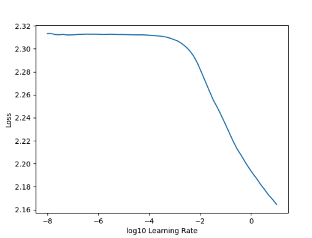
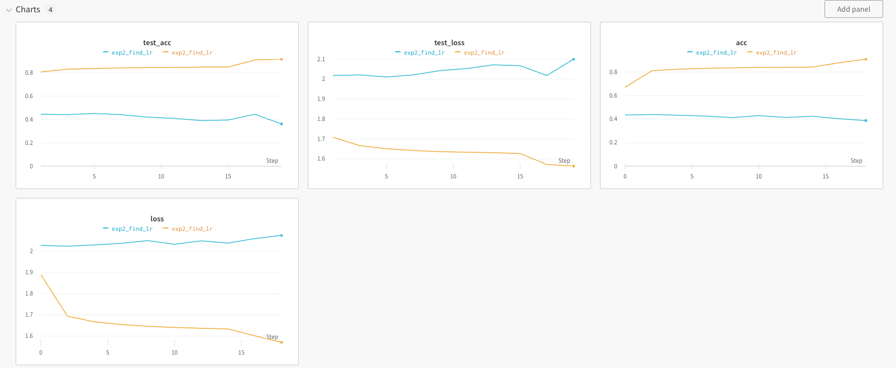
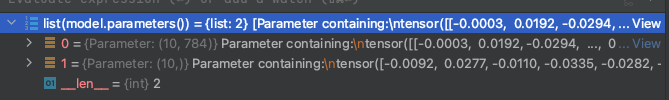
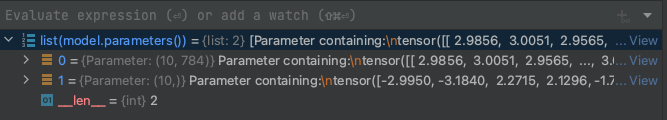
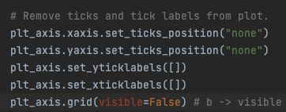

# DNN
## exp2_find_lr.py
- find learning late  

- find_lr() 적용 전과 전용 후의 결과 차이 (파란선이 find_lr() 적용한 그래프)  
=> 초기 모델의 파라미터 세팅을 잘 못함

- find_lr() 초기 모델의 파라미터 값을 변경함
  - find_lr() 적용 전 모델의 파라미터  

  - find_lr() 적용 후 모델의 파라미터

## exp3_integrated_gradients.py
- matplotlib 버전 업데이트로 인해 visualize_image_attr()에 들어가서 grid() 파라미터 명 변경 필요 

